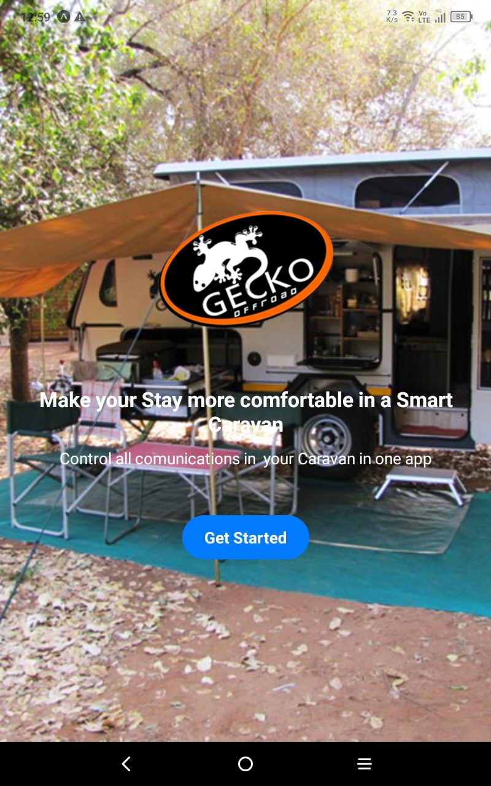
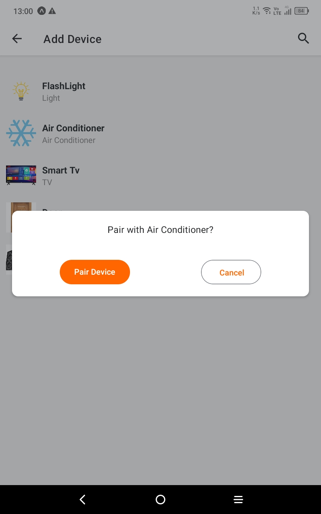
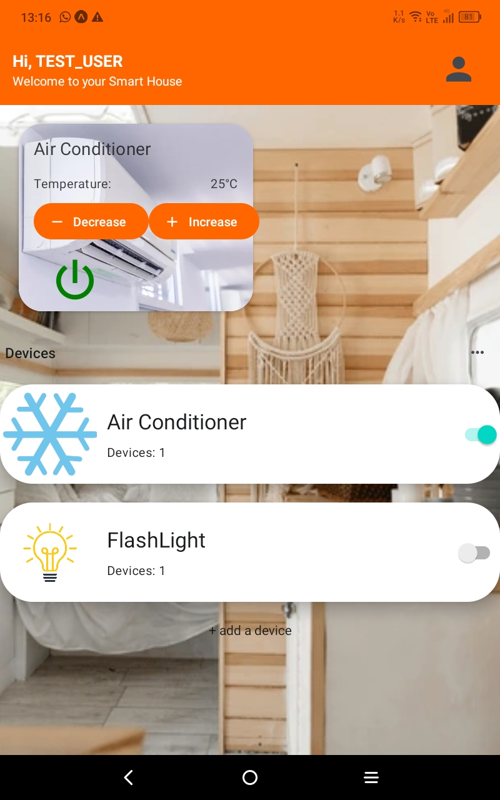

# Smart Geeko App

Smart Geeko is a smart home system designed specifically for caravans, offering the convenience of a Google Home-like experience tailored to mobile living. With Smart Geeko, you can easily pair devices within your caravan and control them seamlessly, enhancing your comfort and convenience while on the road.

## Features

- **Device Pairing**: Easily pair various smart devices within your caravan to the Smart Geeko system, allowing for centralized control.
- **Voice Control(coming soon)**: Utilize voice commands to control connected devices, making interaction intuitive and hands-free.

- **Mobile App Integration**: Manage your caravan's smart devices remotely via the Smart Geeko mobile app, ensuring control even when you're away from your caravan.
- **Customizable Settings**: Tailor Smart Geeko to your preferences with customizable settings for device behavior and automation.
- **Compatibility**: Works with a wide range of smart devices commonly found in caravans, ensuring compatibility with your existing setup.
- **User-Friendly Interface**: Enjoy a user-friendly interface that simplifies device management and control for users of all levels of tech proficiency.

## Screenshots

_Landing Page_

_Add A Device_

_Home_

